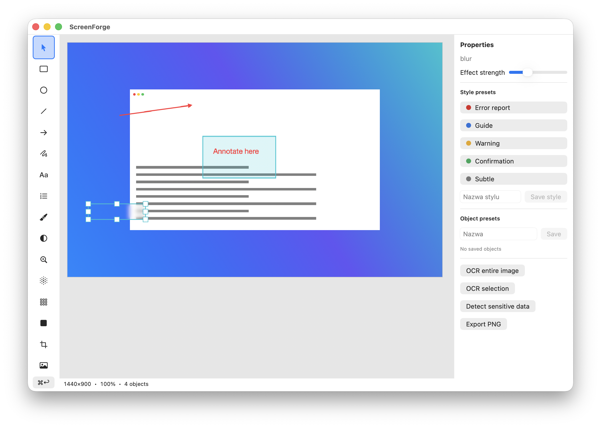
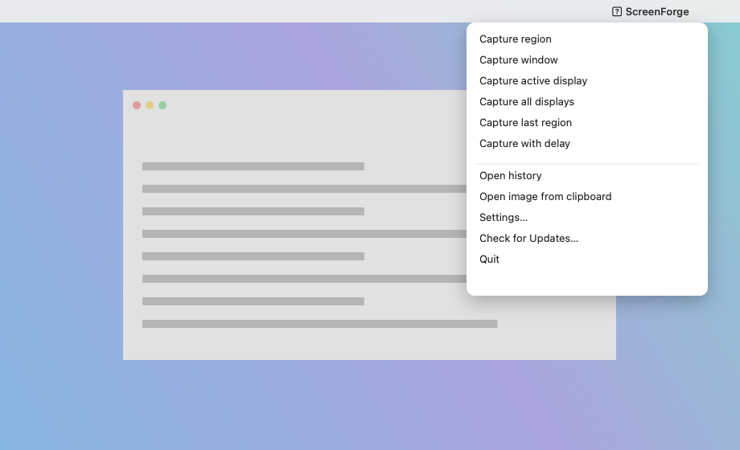
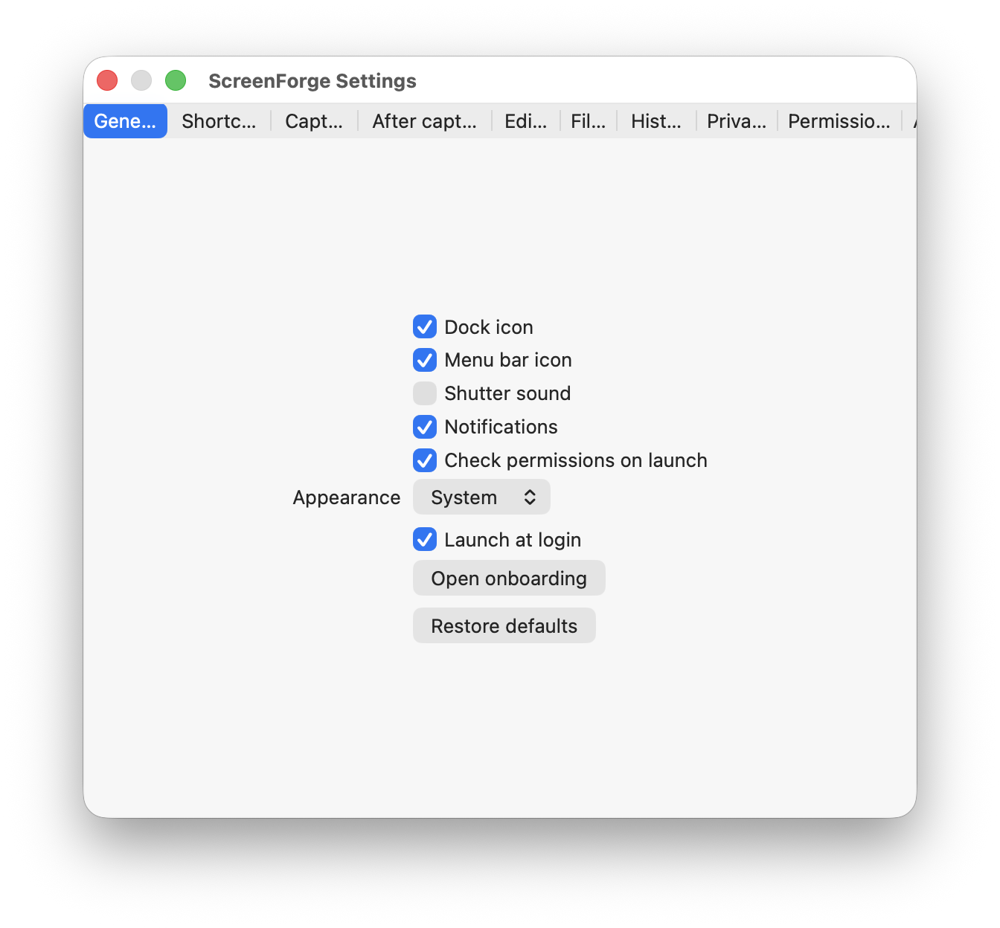
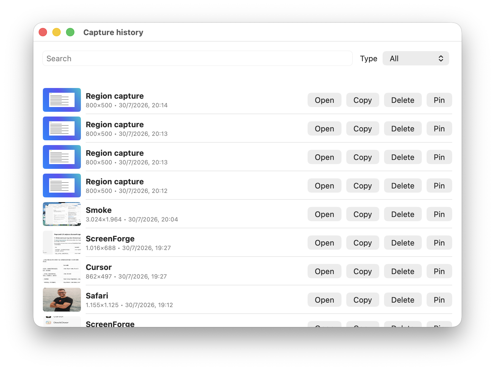

# ScreenForge

**Native screenshot capture & annotation for macOS** — region, window, and display capture with a local editor. No account. No cloud. No telemetry.

<p align="center">
  
</p>

<p align="center">
  <a href="https://github.com/fabianszymczak1-cloud/ScreenForge/releases/latest"></a>
  <a href="https://buymeacoffee.com/5r8nffw85nw"></a>
  
  
</p>

## Download

**[Download ScreenForge.dmg](https://github.com/fabianszymczak1-cloud/ScreenForge/releases/latest/download/ScreenForge.dmg)** (latest release)

If ScreenForge helps you, you can support development here:

**[Buy Me a Coffee](https://buymeacoffee.com/5r8nffw85nw)**

## Features

| | |
|---|---|
| **Region / window / display** | Capture with ⌃⇧ shortcuts; quick copy with ⌃⌥ |
| **Annotation editor** | Shapes, arrows, text, blur, pixelate, highlight, crop |
| **OCR & redact** | Recognize text; detect emails/phones/IDs and solid-redact |
| **History** | Local capture history with thumbnails |
| **Private by design** | Everything stays on your Mac |
| **Auto-updates** | Sparkle checks GitHub Releases |
| **EN + PL** | Follows your macOS system language |

<p align="center">
  
  &nbsp;
  
</p>

<p align="center">
  
</p>

## Install

1. Download the DMG and drag **ScreenForge** to **Applications** (do not run it from the DMG).
2. Open the app (menu bar camera icon).
3. Grant **Screen Recording** when onboarding asks.
4. Press **⌃⇧1** to capture a region and open the editor.

## macOS security warning (“malware” / “cannot be opened”)

ScreenForge is **not malware**. Builds are currently **ad-hoc signed** (no paid Apple Developer ID / notarization yet), so Gatekeeper may show warnings such as:

- *“Apple could not verify ScreenForge is free of malware”*
- *“ScreenForge cannot be opened because it is from an unidentified developer”*
- *“ScreenForge was blocked to protect your Mac”*

That is expected for open-source apps without notarization. You only need to allow it **once**.

### Option A — System Settings (recommended)

1. Try to open **ScreenForge** once (from `/Applications`). If macOS blocks it, click **Done** / **OK**.
2. Open **System Settings → Privacy & Security**.
3. Scroll down to the security section. You should see a message about ScreenForge being blocked.
4. Click **Open Anyway**.
5. Confirm again in the dialog (**Open**).
6. If prompted, enter your Mac password / Touch ID.

On some macOS versions the button appears only **after** the first blocked open attempt.

### Option B — Terminal (always works)

```bash
xattr -dr com.apple.quarantine /Applications/ScreenForge.app
```

Then open ScreenForge again from Applications.

### After that

- Menu bar icon should appear (camera viewfinder).
- Complete onboarding and grant **Screen Recording**.
- Future updates via **Sparkle** (Check for Updates) usually do not need this step again.

If something still fails, make sure the app is in `/Applications` and not sitting on the Desktop or inside the mounted DMG.

## Keyboard shortcuts

| Shortcut | Action |
|----------|--------|
| ⌃⇧1 | Region → editor |
| ⌃⇧2 | Window → editor |
| ⌃⇧3 | Active display |
| ⌃⇧4 | All displays |
| ⌃⇧5 | Last region → editor |
| ⌃⇧6 | Delayed capture |
| ⌃⇧7 | History |
| ⌃⇧8 | Last capture in editor |
| ⌃⌥1 | Region → clipboard |
| ⌃⌥2 | Window → clipboard |
| ⌃⌥3 | Display → clipboard |
| ⌃⌥4 | Last region → clipboard |

## Support

ScreenForge is free. Tips keep the project going:

[](https://buymeacoffee.com/5r8nffw85nw)

## Auto-updates

Use **bar **Check for Updates…**. Updates are signed with Sparkle (EdDSA) and served from GitHub Releases.

## Build from source

```bash
cd ScreenForge
./Scripts/build_app.sh Release
# optional DMG:
./Scripts/make_dmg.sh 1.0.0
cp -R build/DerivedData/Build/Products/Release/ScreenForge.app /Applications/
```

Release (needs `gh` auth + Sparkle private key in `Secrets/`):

```bash
./Scripts/release.sh 1.0.0
```

## License

Original code for this project. Not affiliated with Greenshot.
